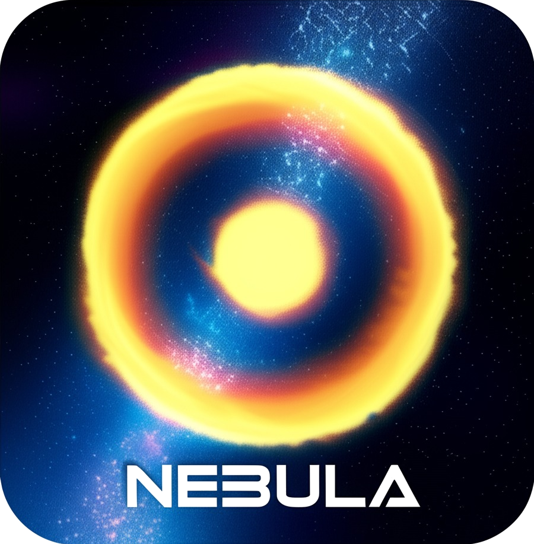
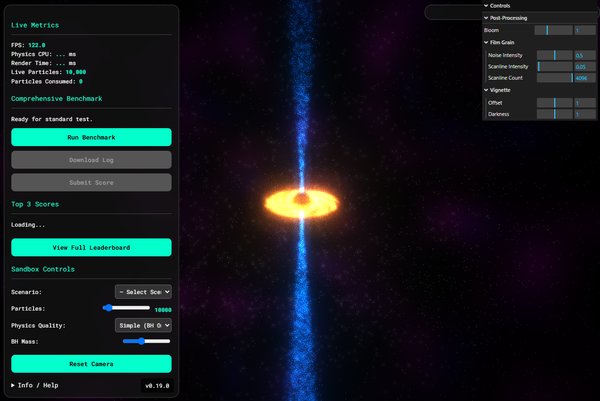

<div align="center">



# **Nebula AUSP**

### The Adaptive Universal System Profiler

**A next-generation, browser-based benchmark that provides a comprehensive performance profile of your system.**

<br>

<a href="https://madgoathaz.github.io/nebula-ausp/">
  
</a>
<a href="https://github.com/MadGoatHaz/nebula-ausp/actions/workflows/deploy.yml">
  
</a>
<a href="https://github.com/sponsors/MadGoatHaz">
  
</a>

</div>

---



---

### **About The Project**
**Nebula AUSP (Adaptive Universal System Profiler)** is a cutting-edge benchmarking tool designed for the modern web. It moves beyond simple FPS counters to run a **gauntlet of specialized tests** that isolate and measure the performance of key system components, including the CPU, GPU, and memory bandwidth.

> The core philosophy is **adaptive testing**. Nebula intelligently detects your system's capabilities to run a tailored set of tests. This ensures that any device—from a low-power laptop to a high-end gaming rig—can receive a meaningful and comparable score, creating a fair and competitive platform for all users.

---

### **Key Features**
-   **Comprehensive "Gauntlet" Benchmark:** A multi-stage test that analyzes various aspects of your system, including a Max-Q Search, GPU Stress Test, and CPU Stress Test.
-   **Advanced Physics Simulation:** A multi-threaded physics engine simulates hundreds of thousands of particles interacting with a central black hole.
-   **Rich & Dynamic Visuals:** Rendered with Three.js, the scene features a procedural accretion disk, polar jets, and a multi-layered nebula, all running in real-time.
-   **Live Diagnostics:** An on-screen panel provides real-time insight into FPS, particle counts, and benchmark progress.
-   **Modern Tech Stack:** Built with Vite.js, modular JavaScript, and a Web Worker architecture for maximum performance and maintainability.

---

### **Tech Stack**
The project is built with a modern, modular frontend stack.

| Tech | Role |
| :--- | :--- |
| **Three.js** | 3D Rendering |
| **Vite.js** | Frontend Tooling |
| **Web Workers**| Multi-threaded Physics |
| **Express.js** | Leaderboard Backend |
| **gh-pages** | Deployment |

---

### ❤️ Support This Project

If you find Nebula AUSP impressive, please consider supporting its development. Your contributions help fund the research and development of next-generation web benchmarks.

- **[Sponsor on GitHub](https://github.com/sponsors/MadGoatHaz)**
- **[Send a tip via PayPal](https://paypal.me/garretthazlett)**

---

### **Development Roadmap**
Our vision for Nebula is ambitious. We're building the ultimate tool for system profiling on the web, and our progress is tracked in phases. See the [open issues](https://github.com/MadGoatHaz/nebula-ausp/issues) for a full list of proposed features and known bugs.

---

### **Phase 1: Foundation & Core Benchmark**
-   **Status:** ✅ **Complete**
-   **Objective:** Establish a robust, modern architecture and implement the core multi-stage benchmark "gauntlet."
-   **Key Results:**
    -   [x] **Modern Tooling:** Project fully migrated to Vite.js for a blazing-fast development experience and optimized builds.
    -   [x] **Decoupled Architecture:** Physics engine isolated in a Web Worker, ensuring a smooth, non-blocking UI.
    -   [x] **Adaptive Max-Q Search:** Initial benchmark stage that intelligently finds the maximum particle load a system can handle at a target FPS.
    -   [x] **Gauntlet Implemented:** Multi-stage stress tests for GPU (fill-rate, shaders), CPU (physics, collisions), and combined system load.
    -   [x] **Scoring v1.0:** A foundational scoring algorithm that provides a comprehensive and comparable metric based on gauntlet results.

---

### **Phase 2: Leaderboard & Community**
-   **Status:** 🔳 **In Progress**
-   **Objective:** Build the backend services and frontend UI for a global leaderboard, turning a personal tool into a community platform.
-   **Key Tasks:**
    -   [ ] **System Info Collector:** Enhance the system profiler to gather more detailed (but still privacy-respecting) hardware information to accompany scores.
    -   [ ] **Backend API:** Develop a lightweight, serverless backend (e.g., using Cloudflare Workers) to securely receive and process benchmark submissions.
    -   [ ] **Persistent Storage:** Implement a reliable database (e.g., KV store, D1, or PostgreSQL) to store scores and system profiles.
    -   [ ] **Submission UI:** Refine the "Submit Score" flow within the application for a seamless user experience.
    -   [ ] **Live Leaderboard:** Create a public-facing leaderboard page with filtering, sorting, and direct links to individual results.

---

### **Phase 3: The Next Frontier - Advanced Testing**
-   **Status:** 🔲 **Planned**
-   **Objective:** Push the boundaries of web-based benchmarking by leveraging cutting-edge browser technologies to reward and analyze modern hardware.
-   **Key Tasks:**
    -   [ ] **WASM/SIMD Physics Test:** Develop a hyper-optimized physics simulation in Rust or C++, compiled to WebAssembly. This will serve as a bonus test to measure raw, single-threaded CPU performance, leveraging SIMD where available.
    -   [ ] **GPGPU Compute Test:** Move the entire N-body physics simulation from a Web Worker to a WebGPU compute shader. This will be a massive GPGPU test, measuring the parallel processing power of modern GPUs.
    -   [ ] **WebGPU Ray Tracing Test:** Create a new, visually stunning scene specifically designed to test dedicated RT hardware. This advanced test will only run if the browser reports support for the WebGPU ray-tracing pipeline, providing a true measure of next-generation graphics capabilities.

---

### **Getting Started**
To get a local copy up and running, follow these simple steps.

1.  **Clone the repo**
    ```sh
    git clone https://github.com/MadGoatHaz/nebula-ausp.git
    ```
2.  **Install NPM packages**
    ```sh
    cd nebula-ausp
    npm install
    ```
3.  **Run the dev server**
    ```sh
    npm run dev
    ```

---
> **License** · Distributed under the GPL-3.0 License. See `LICENSE` for more information.